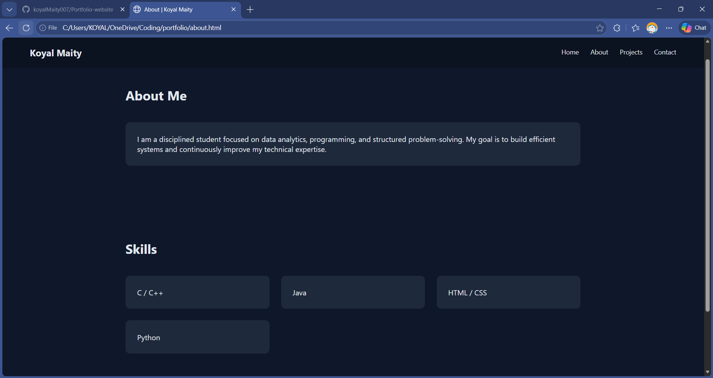

# Koyal Maity — Portfolio Website

This is my personal portfolio website built to showcase my projects, skills, and progress as an aspiring Data Analyst.

## 🔍 Overview

The website presents a clean and minimal interface with sections for:

* Introduction
* About Me
* Projects
* Contact

## ⚙️ Tech Stack

* HTML5
* CSS3

## 🚀 Features

* Responsive layout
* Simple navigation
* Minimal and focused UI

## 📸 Preview

## 🌐 Live Website

(Will be added after deployment)

## 📂 How to Run Locally

1. Download or clone the repository
2. Open `Portfolio.html` in your browser

---

## 📌 Note

This project is part of my learning journey. Future updates will include:

* Improved UI/UX
* More projects
* Deployment with a live link
